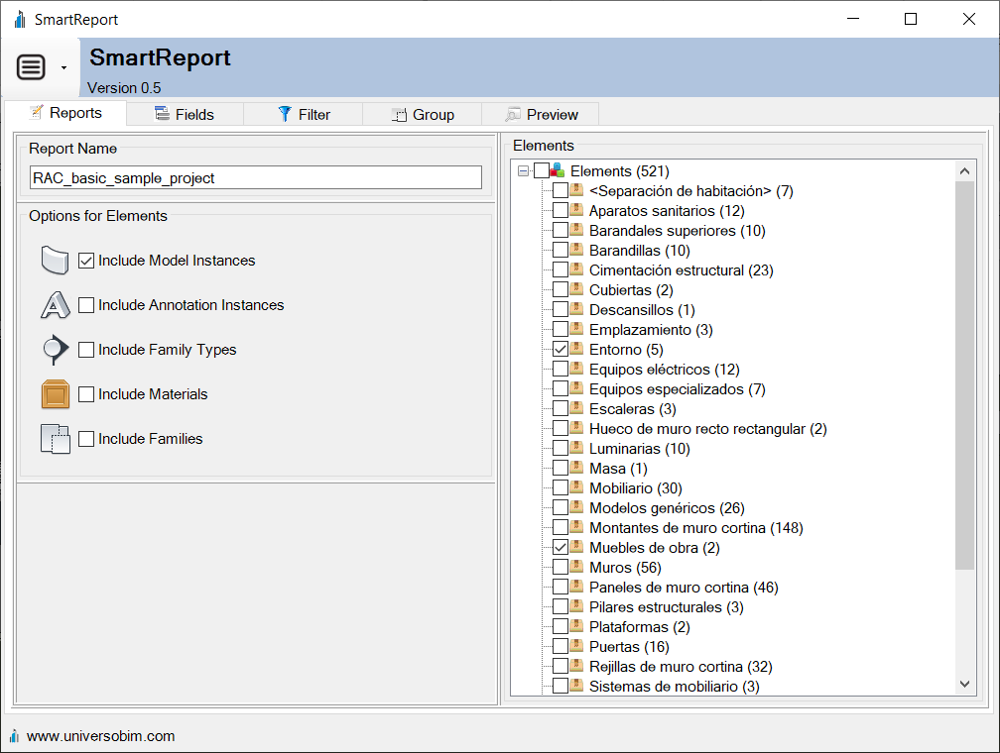

# SmartReport for Revit

SmartReport is a Revit addin that allows you to create an advanced report, collecting information from all elements of the BIM model.

## Requirements
* Autodesk Revit 2022
* Autodesk Revit 2023

## Installer
You can download the latest version installer at this link
* https://github.com/gorovt/SmartReport/releases
